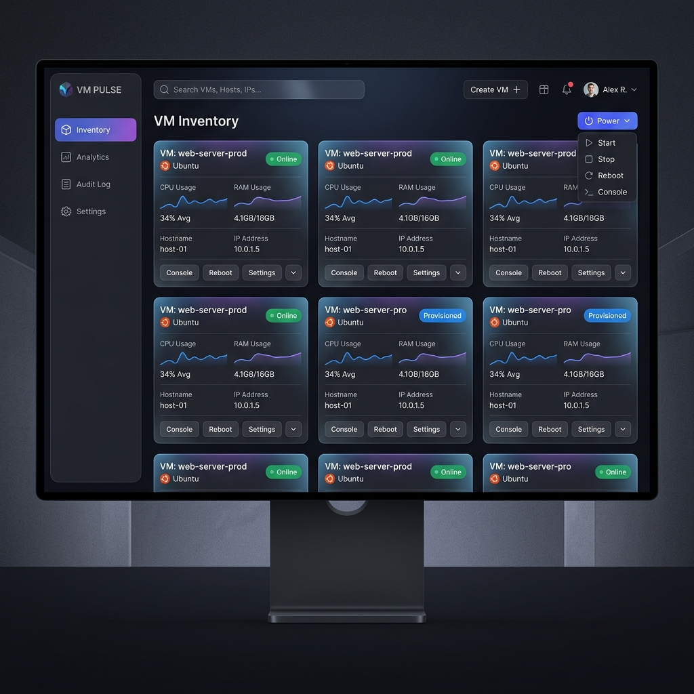
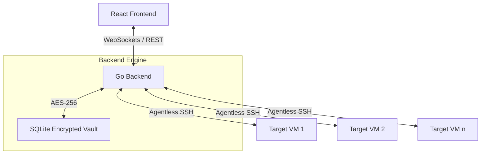
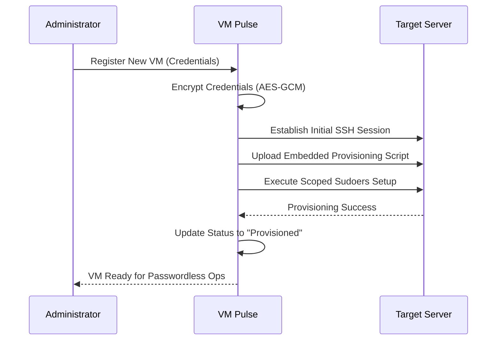

# 🌌 VM Pulse: Enterprise-Grade VM Management



**VM Pulse** is a premium, agentless management platform for virtual infrastructure. Engineered with **Go** and **React**, it provides secure, real-time observability and control over remote Linux servers through an intuitive, dark-mode-first interface.

---

## 🏗️ Architecture Overview

The platform uses a high-concurrency Go backend to manage persistent SSH tunnels and WebSocket streams, ensuring sub-second latency for metrics and terminal interactions.



---

## 🚀 Key Features

### 🛡️ Zero-Touch Secure Provisioning
Eliminate password management. VM Pulse automatically provisions target servers with scoped `sudoers` rules using an embedded, build-time validated engine.



### 📊 Real-Time Observability
- **Advanced Telemetry**: Live tracking of CPU, RAM, and Disk utilization.
- **Network Insights**: Real-time inbound/outbound throughput visualization.
- **Process Explorer**: Sortable, live-updating process list with granular resource consumption.

### ⌨️ Interactive Command & Control
- **Web Terminal**: Full-featured, low-latency SSH terminal via `xterm.js` and WebSockets.
- **Service Management**: Discover and control `systemd` services (Start, Stop, Restart, Enable).
- **Security Dashboard**: Management of `firewalld`, `ufw`, and SELinux states.

---

## 🛠️ Technology Stack

| Layer | Technology |
|:--- |:--- |
| **Backend** | Go 1.25 (Standard Library focus) |
| **Frontend** | React 18, TypeScript 5, Vite |
| **Security** | AES-256-GCM, JWT, SSH Key Vault |
| **Real-time** | Gorilla WebSockets, Recharts, xterm.js |
| **Storage** | SQLite with Auto-Migrations |

---

## 🏁 Getting Started (After Clone)

### 1. Backend Configuration
Navigate to the backend directory and set up your secure environment.

```bash
cd backend
# Generate a secure 32-byte base64 AES key for the vault
openssl rand -base64 32

# Add the generated key to your .env file
echo "AES_KEY=$(openssl rand -base64 32)" > .env
```

### 2. Database Initialization
Run the seeding script to create the initial administrative environment.

```bash
make deps
make seed
```

### 3. Launch the Platform
Start both the backend server and the frontend development environment.

**Terminal 1 (Backend):**
```bash
cd backend
make run
```

**Terminal 2 (Frontend):**
```bash
cd frontend
npm install
npm run dev
```

The application will be accessible at `http://localhost:5173`. Default login credentials can be found in `backend/cmd/seed/main.go`.

---

## ⌨️ Development Commands (Backend)

The project includes a `Makefile` in the `backend/` directory for common development tasks.

| Command | Description |
|:--- |:--- |
| `make deps` | Download and tidy Go dependencies. |
| `make build` | Compile the server binary to `bin/server`. |
| `make run` | Start the backend server (shortcut for `go run`). |
| `make seed` | Initialize the SQLite database with seed data. |
| `make test` | Run the full backend test suite. |
| `make test-provision` | Run integration tests for the provisioning engine. |
| `make benchmark` | Run performance benchmarks for API handlers. |
| `make clean` | Remove build artifacts and reset the database. |

---

## 🛡️ Security Best Practices
- **Credential Storage**: All credentials (passwords, private keys) are encrypted using AES-256-GCM before being persisted to the database.
- **Agentless**: No software or agents are installed on target servers, reducing the attack surface.
- **Auditing**: Every interactive session and management action is logged with a high-resolution timestamp and user identity.

---
*Built with Antigravity — Professional Agentic Engineering.*
