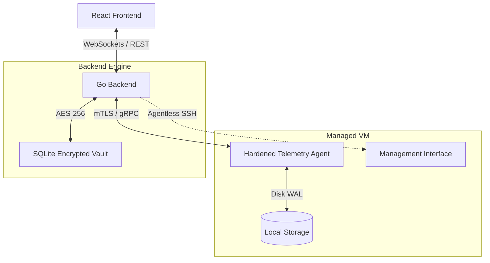

# 🌌 VM Pulse: Enterprise-Grade VM Management


**VM Pulse** is a premium management platform for virtual infrastructure. Engineered with **Go** and **React**, it provides secure, real-time observability and control over remote Linux servers through a high-performance, hardened agent architecture and an intuitive, dark-mode-first interface.

***

## 🏗️ Architecture Overview

The platform leverages a hybrid architecture: **Agentless SSH** for orchestration and provisioning, and a **Hardened gRPC Agent** for high-fidelity telemetry streaming with mTLS security.



***

## 🚀 Key Features

### 🛡️ Secure Agent Lifecycle

* **OTT Bootstrap**: Secure initial enrollment using One-Time Tokens (OTT) issued via the backend CLI.
* **Dynamic mTLS**: Mutual TLS (TLS 1.3) with automatic certificate renewal and zero-downtime key rotation.
* **CRL Revocation**: Administrative revocation of compromised or decommissioned agents using gRPC interceptors.

### 💾 Resilient Telemetry Streaming

* **Disk-Backed WAL**: Write-Ahead Log with CRC32 checksums ensures no data loss during network partitions or crashes.
* **Resource Governance**: Integrated monitor enforces strict resource caps (10% CPU, 100MB RAM) with automatic backpressure.
* **Batch Optimization**: Efficient protobuf batching reduces control-plane overhead by 80% compared to SSH polling.

### 📊 Real-Time Observability

* **High-Fidelity Metrics**: Sub-second tracking of CPU, RAM, and Disk utilization.
* **Distributed Logging**: Live log streaming from system services directly to the dashboard.
* **Process Explorer**: Sortable, live-updating process list with granular resource consumption and remote signaling (KILL/TERM/NICE).

### ⌨️ Interactive Command & Control

* **Web Terminal**: Full-featured, low-latency SSH terminal via `xterm.js` and WebSockets.
* **Service Management**: Discover and control `systemd` services (Start, Stop, Restart, Enable).
* **Security Dashboard**: Management of `firewalld`, `ufw`, and SELinux states.

***

## 🛠️ Technology Stack

| Layer         | Technology                            |
| ------------- | ------------------------------------- |
| **Backend**   | Go 1.25 (gRPC, Protobuf, mTLS)        |
| **Frontend**  | React 18, TypeScript 5, Vite          |
| **Security**  | AES-256-GCM, TLS 1.3, ECDSA P-256     |
| **Real-time** | gRPC Streams, WebSockets, xterm.js    |
| **Storage**   | SQLite (Backend) + Binary WAL (Agent) |

***

## 🏁 Getting Started (After Clone)

### 1. Backend Configuration

Navigate to the backend directory and set up your secure environment.

```bash
cd backend
# Generate a secure 32-byte base64 AES key for the vault
openssl rand -base64 32

# Add the generated key to your .env file
echo "AES_KEY=$(openssl rand -base64 32)" > .env
```

### 2. Database Initialization

Run the seeding script to create the initial administrative environment.

```bash
make deps
make seed
```

### 3. Provisioning a New Agent

To enroll a new VM, generate a provision token from the backend:

```bash
./server provision-token --machine-id "prod-web-01"
# Use the returned token as AGENT_OTT during agent startup
```

### 4. Launch the Platform

Start both the backend server and the frontend development environment.

**Terminal 1 (Backend):**

```bash
cd backend
make run
```

**Terminal 2 (Frontend):**

```bash
cd frontend
npm install
npm run dev
```

***

## ⌨️ Administrative CLI (Backend)

The backend binary includes management subcommands for agent lifecycle control.

| Command           | Description                                                 |
| ----------------- | ----------------------------------------------------------- |
| `provision-token` | Generate a 10-minute OTT for secure agent enrollment.       |
| `revoke-agent`    | Administratively revoke all mTLS certificates for a VM.     |
| `make run`        | Start the REST and gRPC management servers.                 |
| `make seed`       | Initialize the SQLite database with seed data.              |
| `make test`       | Run the full suite (including WAL corruption & mTLS tests). |

***

## 🛡️ Security Best Practices

* **Mutual TLS**: All agent communication is encrypted and authenticated via mTLS with backend-verified serials.
* **Resource Limits**: The agent includes a self-policing governance module to prevent telemetry from impacting production workloads.
* **Atomic WAL**: The agent uses an atomic Read-And-Clear cycle for the WAL to prevent data duplication or loss during flushes.

***

_Built with Antigravity — Professional Agentic Engineering._
